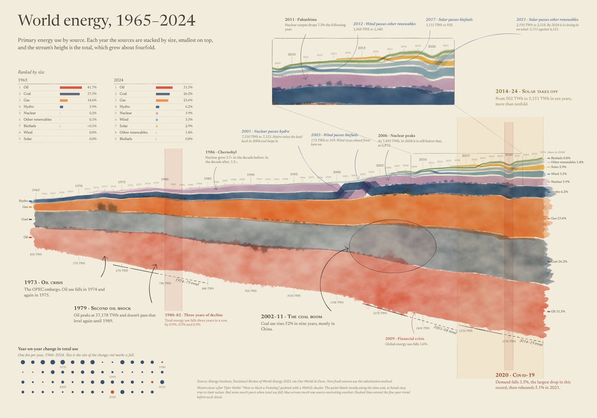

# World energy, 1965–2024, in watercolour

A bump stream of world primary energy use by source, painted with code pretending to be watercolour.

**Live:** [gitnoise.github.io/energywatercolour](https://gitnoise.github.io/energywatercolour/)



Every render follows from a seed: **Redraw by hand** picks a new one, **Repaint this seed** reproduces one exactly.

## How it works

- **Paint.** Band edges are deformed with Tyler Hobbs' recursive subdivision algorithm ("[How to Hack a Painting](https://www.tylerxhobbs.com/words/how-to-hack-a-painting)"), then painted by a WebGL2 watercolour shader (bleed, pooling, granulation, paper fibres, darker edges).
- **Data-aware water.** Distortion runs mostly along the time axis so bands stay true to their values. Thin bands get less water, and a few "wet" stretches bleed slightly into their neighbours.
- **Bump stream.** Each year the sources are stacked by size, smallest on top, so overtakes show as crossings. D3 linear scales and Catmull–Rom interpolation handle the layout.
- **Annotations.** Swoopy arrows (after Bloomberg Businessweek's [swoopyarrows](https://github.com/bizweekgraphics/swoopyarrows)), a force-directed note layout that avoids overlapping notes and crossing arrows, primary and secondary notes, a magnified cutout, and pencil ruler lines for the five-year trend before each shock.

## Code

| File | What it does |
| --- | --- |
| `js/main.js` | The page: buttons, seeds, running a render task by task |
| `js/chart.js` | The composition: data → bump stream → watercolour bands → annotations |
| `js/stream.js` | Bump-stream scales, Catmull–Rom sampling, band-outline helpers |
| `js/layout.js` | Force-directed placement of notes and routing of their swoopy arrows |
| `js/watercolor.js` | WebGL2 watercolour shader: takes an SVG shape, returns it painted |
| `js/hobbs.js` | Tyler Hobbs' polygon deformation |
| `js/pen.js` | Hand-drawn pen, text helpers, swoopy arrows |
| `js/geometry.js` | Shared 2D geometry for annotation layout (boxes, segments) |
| `js/events.js` | Annotation events (crises, overtakes, multi-year highlights) |
| `js/random.js` | Seeded random numbers and noise |
| `js/canvas.js` | The canvas and the base palette |
| `js/data.js` | The energy data |

No bundler required. [D3](https://d3js.org/) is loaded from a CDN import map in `index.html`; `npm install` is only needed if you use Vite locally.

## Running it locally

The code uses ES modules, which browsers won't load from a file opened directly. Serve the folder instead:

```
python3 -m http.server
```

or, with Vite:

```
npm install
npm run dev
```

Then open the address it prints. A browser with WebGL2 is required (any current Chrome, Edge, Firefox or Safari).

Pushes to `main` deploy automatically to GitHub Pages via `.github/workflows/pages.yml`.

## Data

Energy Institute, *Statistical Review of World Energy 2025*, via Our World in Data. Non-fossil sources use the substitution method.
